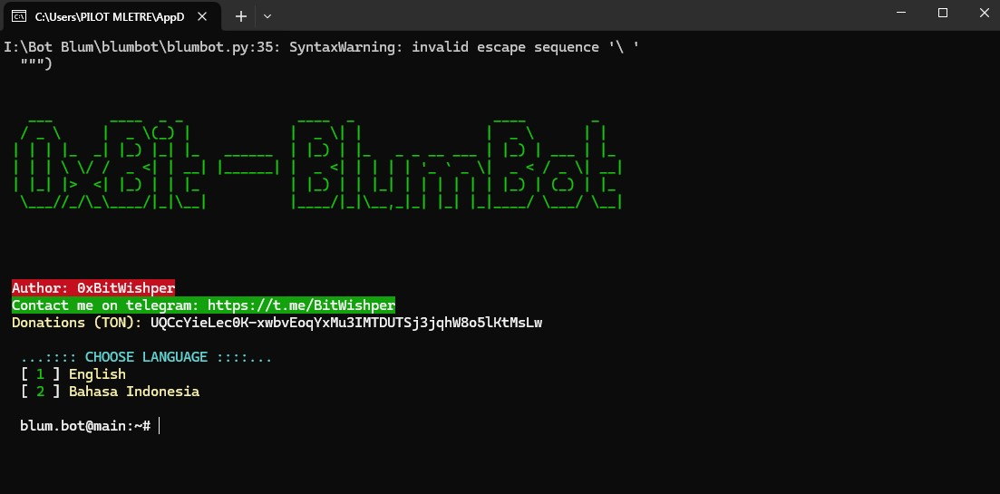

# Blum Bot



Bot auto clicker untuk Airdrop Blum - Bot Python ini berjalan secara mandiri, memanfaatkan modul pynput dan keyboard. Dirancang untuk Python 3.11.6,

## Fitur

- Autoclick Blum Airdrop
- Gunakan `termcolor`,`pynput`, `pyautogui`, `pygetwindow` and `keyboard`
- Mengunakan Python 3.11.6.

## Persyaratan

- Python 3.11.6 (recommended)
- `termcolor` module
- `pyautogui` module
- `pygetwindow` module
- `pynput` module
- `keyboard` module

## Instalasi

### Prasyarat

Pastikan Anda telah menginstal Python 3.11.6 di sistem Anda. Anda dapat mengunduhnya dari situs resmi[Python website] (https://www.python.org/downloads/release/python-3116/).

### Steps

1. **Duplikat repository**

   git clone https://github.com/0xBitWishper/BlumBot-Airdrop.git

2. **Instal modul yang diperlukan**

   Instal modul Python yang diperlukan menggunakan `pip`:

   ```sh
   pip install termcolor
   pip install colorama
   pip install pynput
   pip install keyboard
   pip install pyautogui
   pip install pygetwindow
   ```

3. **Run the script**

   Execute the `blumbot.py` script:

**Enjoying!**
